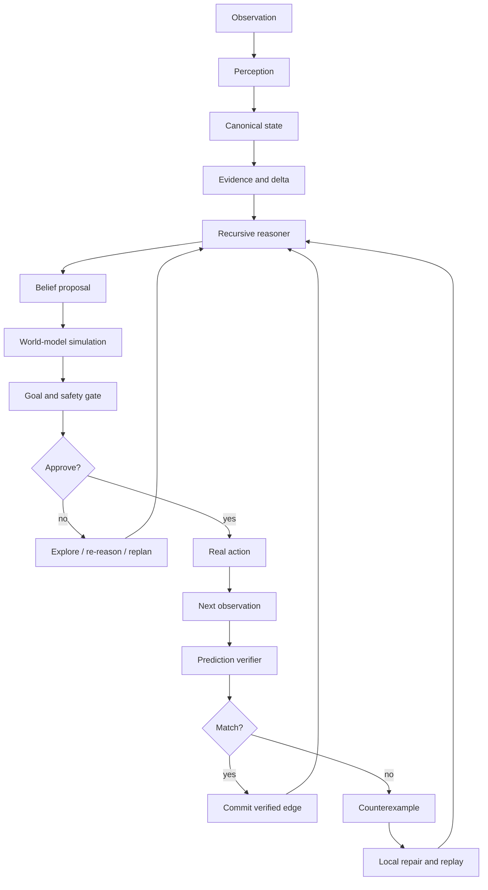
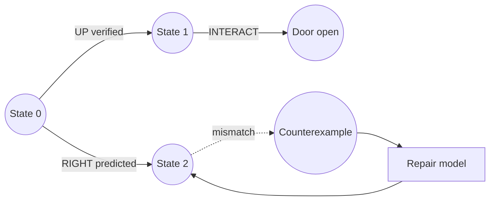
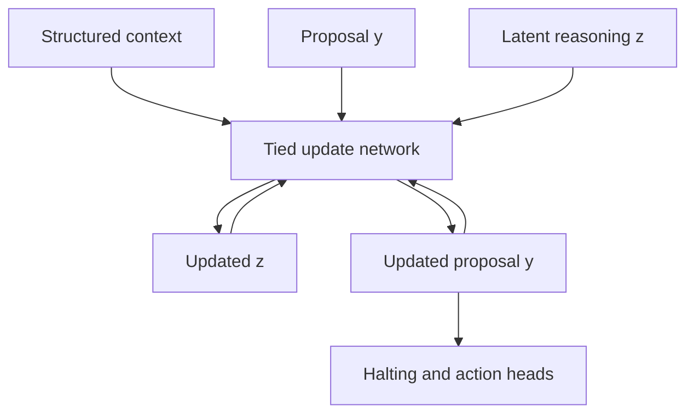

# ARC-X Recursive Control Loop

```mermaid
flowchart TD
  O[Observation] --> P[Perception]
  P --> S[Canonical state]
  S --> E[Evidence and delta]
  E --> R[Recursive reasoner]
  R --> B[Belief proposal]
  B --> W[World-model simulation]
  W --> G[Goal and safety gate]
  G --> D{Approve?}
  D -- no --> X[Explore / re-reason / replan]
  X --> R
  D -- yes --> A[Real action]
  A --> N[Next observation]
  N --> V[Prediction verifier]
  V --> M{Match?}
  M -- yes --> C[Commit verified edge]
  M -- no --> Q[Counterexample]
  Q --> L[Local repair and replay]
  L --> R
  C --> R
```

## State graph

```mermaid
flowchart LR
  S0((State 0)) -->|UP verified| S1((State 1))
  S0 -->|RIGHT predicted| S2((State 2))
  S1 -->|INTERACT| S3((Door open))
  S2 -. mismatch .-> F((Counterexample))
  F --> R[Repair model]
  R --> S2
```

## Recursive belief update

```mermaid
flowchart TD
  C[Structured context] --> T[Tied update network]
  Y[Proposal y] --> T
  Z[Latent reasoning z] --> T
  T --> Z2[Updated z]
  T --> Y2[Updated proposal y]
  Y2 --> H[Halting and action heads]
  Z2 --> T
  Y2 --> T
```
